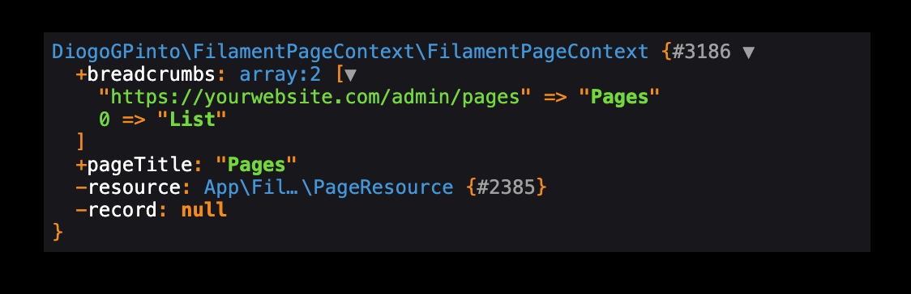
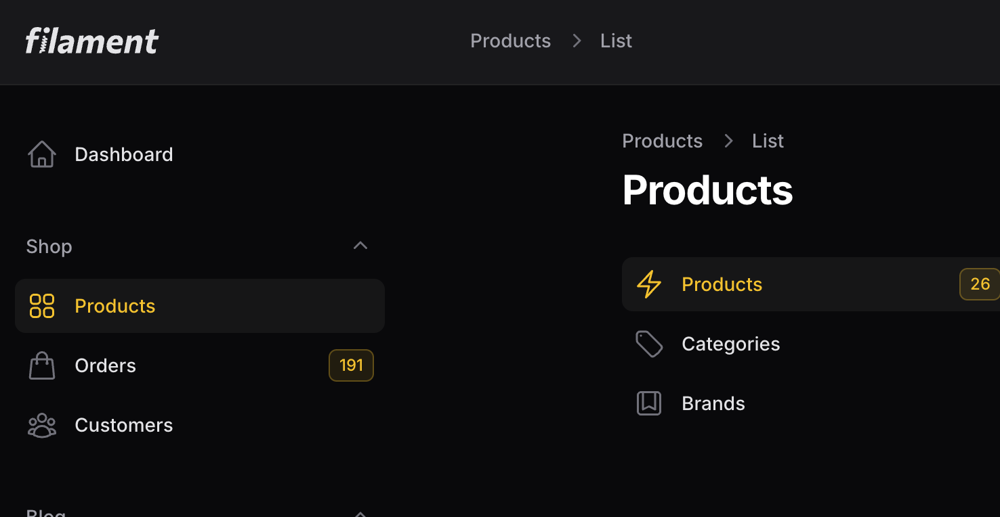

# Filament Panel Page Context

[](https://packagist.org/packages/diogogpinto/filament-page-context)
[](https://github.com/diogogpinto/filament-page-context/actions?query=workflow%3Arun-tests+branch%3Amain)
[](https://github.com/diogogpinto/filament-page-context/actions?query=workflow%3A"Fix+PHP+code+styling"+branch%3Amain)
[](https://packagist.org/packages/diogogpinto/filament-page-context)

A Filament plugin that automatically injects current request breadcrumbs and page title into the filament() method, enhancing context and navigation for admin panels. Developed with theme extensibility in mind, it seamlessly integrates with and allows further customization of Filament themes. Created with the purpose to get current request breadcrumbs and pagetitle and inject them anywhere in the panel.

It currently returns the current request's Filament breadcrumbs (with Filament's structure) and Page Title (can be a Custom Page Title, Resource Related Title or Record Related Title).  



## Installation

You can install the package via composer:

```bash
composer require diogogpinto/filament-page-context
```

## Usage

That's it. Once you install this plugin, the FilamentPageContext Service Provider will be injected automatically into Laravel Service Providers and extend your filament() method.

### Getting Filament's current request breadrcrumbs

```php
$breadcrumbs = filament()->pageContext()->breadcrumbs;
```

### Getting Filament's current request page title

```php
$pageTitle = filament()->pageContext()->pageTitle;
```

### Add Filament's breadcrumbs to your topbar



This is a request I've been getting lately that will have its own plugin really soon. Until then, you can follow the guide below:

1. Create a new view (resources/views/topbar-breadrcumbs.php) and add the following code:

```php
@props([
    'breadcrumbs' => filament()->pageContext()->breadcrumbs,
])

<x-filament::breadcrumbs class="text-sm/[6px]" :breadcrumbs="$breadcrumbs"/>
```

2. Add the following snippet to your AppServiceProvider.php
```php
/**
 * Bootstrap any application services.
 *
 * @return void
 */
public function boot()
{
    // your other methods
    FilamentView::registerRenderHook(
        PanelsRenderHook::TOPBAR_START,
        fn (): View => view('topbar-breadcrumbs'),
    );
}
```

> :warning: **Warning:** This is just an example of how to inject breadcrumbs in the topbar. You should be aware that this code isn't responsive and can mess your mobile functionality.

## Testing

```bash
composer test
```

## Changelog

Please see [CHANGELOG](CHANGELOG.md) for more information on what has changed recently.

## Contributing

Please see [CONTRIBUTING](.github/CONTRIBUTING.md) for details.

## Security Vulnerabilities

Please review [our security policy](../../security/policy) on how to report security vulnerabilities.

## Credits

- [Diogo Pinto](https://github.com/diogogpinto)
- [Adam Weston](https://github.com/awcodes) for the mentorship and all the help
- Special thanks to [Tony Partidge](https://github.com/tonypartridge) and [Fady Mondy](https://github.com/3x1io) for all the help over Filament Discord
- [Geridoc](https://www.geridoc.pt) for giving me the opportunity to share our code to the public
- [All Contributors](../../contributors)

## License

The MIT License (MIT). Please see [License File](LICENSE.md) for more information.
